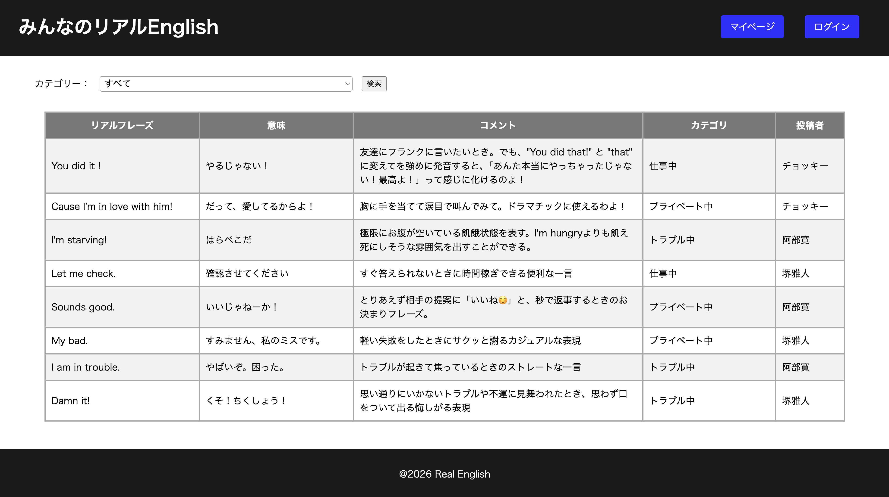
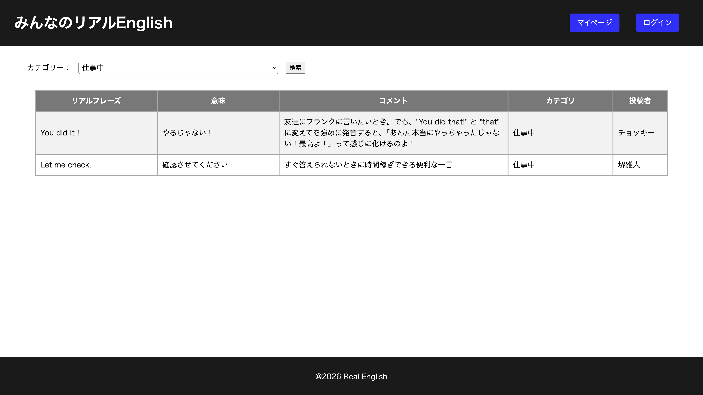
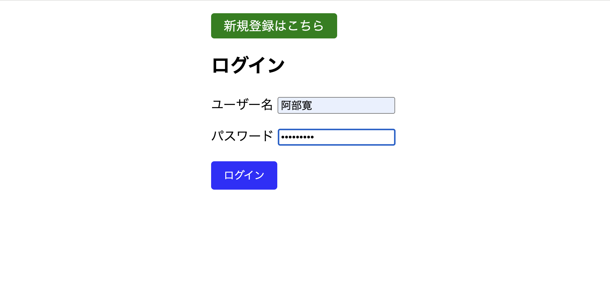
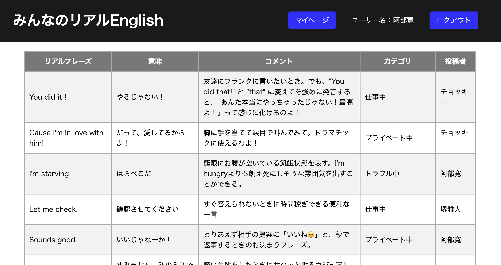
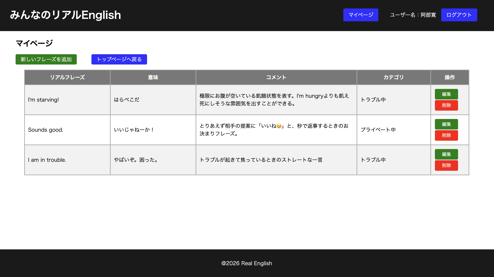
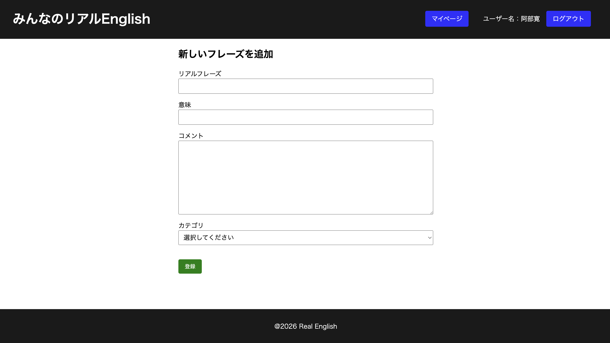
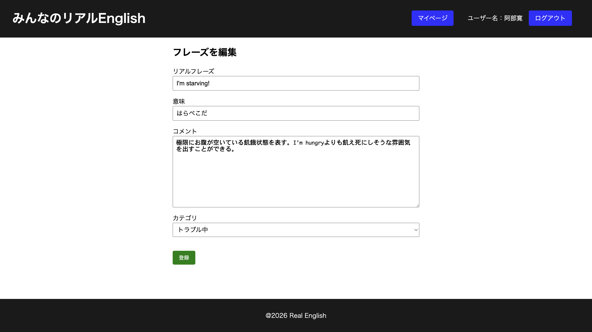
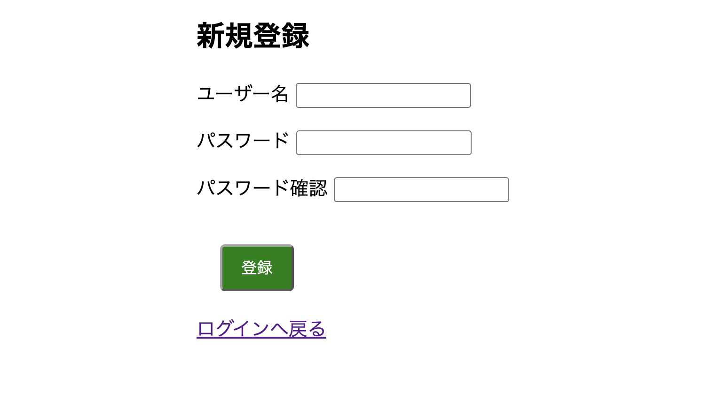

# みんなのリアルEnglish
学校では習わない、リアルな英語表現やフレーズをシェア・蓄積できるWebアプリケーションです。

## できること

- ログインなしで、フレーズ一覧を見る
- カテゴリーごとにフレーズを検索
- ユーザー登録とログイン、ログアウト
- マイページで、自分のフレーズを追加・編集・削除する

## 技術

- Java 17
- Spring Boot 4.1.1
- Thymeleaf
- Spring Data JPA
- MySQL

## ログイン前の一覧画面

## カテゴリーで検索

## ログイン画面

## ログイン後の一覧画面

## マイページ

## 新しいフレーズ登録画面

## フレーズ編集画面

## 新規登録画面

